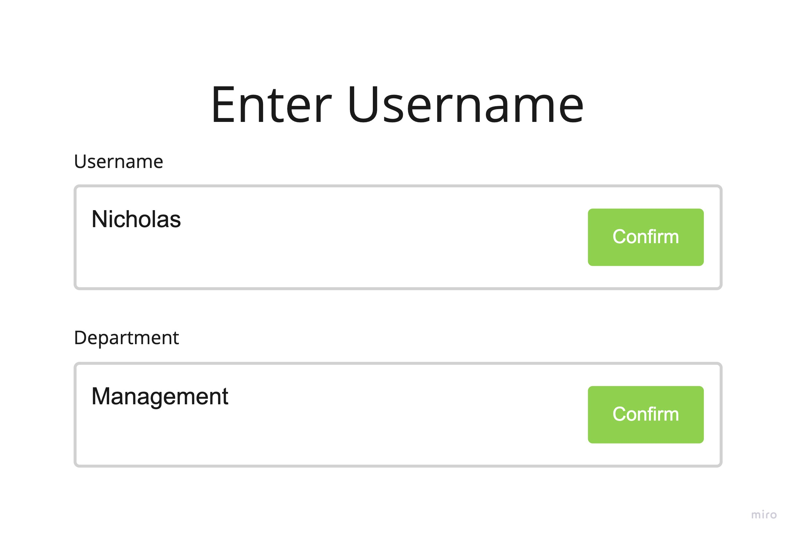
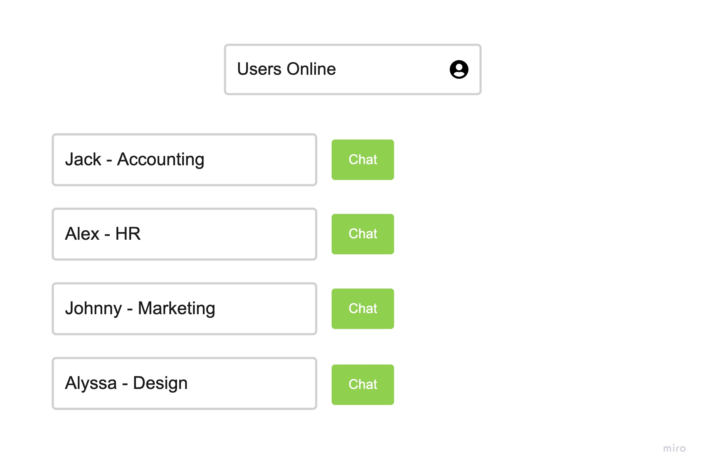
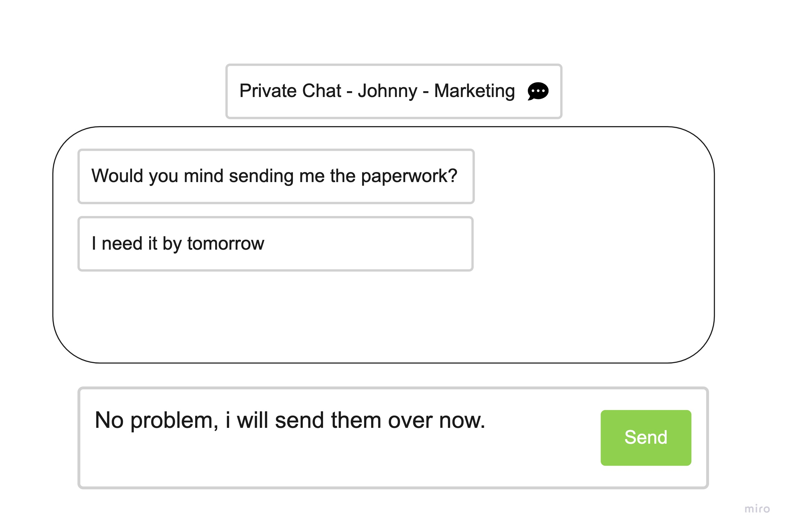
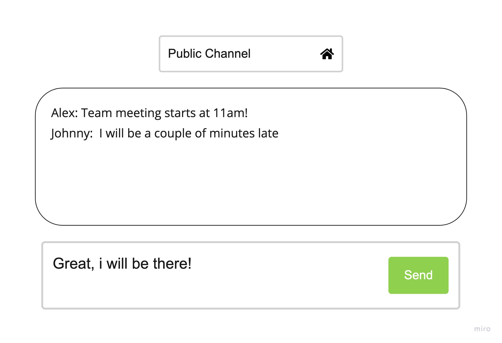

# Project 4 - OfficeTalk (O.T.)

# App Description
OfficeTalk is a messaging/chat application in which users can see others users online, and engage in real time online conversation with them! Users will be able to converse with any other user on their server, and send public messages to other users on the server as well. This makes it great for workflow & office conversation without having to go see your colleagues in person!

# Technologies Used
I wanted to use websockets for this project, since it came up in discussion during the last project for implementing direct messaging to our social media app. Usually chat applications require polling the server for changes, keeping track of timestamps, and a myriad of other processes and in the past this has been very inefficient and slower than it should be. However, Websockets intrigued me for implementing a real-time chat system since it provides bi-directional communication between the client and server. Socket.io enables low-latency and event-based communication between client and server. This means that the server pushes messages to the client, and the server does not need to continuously check if a message has been sent.

## Client Stacks:
* React.js
* Socket.io
* Heroicons
* Tailwind or Bootstrap (Undecided)

## Server Stacks:
* Node.js
* Socket.io

# User Stories:
* As a user, i want a simple/temporary log-in to create an id (or generate random id)
* As a user, i want to be able to add contacts & see them in my contact list
* As a user, i want to be able to send messages to other users
* As a user, i want to be able to start a chat with a single user
* As a user, i want to be able to start a chat with multiple users

# Questions
## How do you plan on learning and implementing this new technology?
* Websocket.io documentation is fairly extensive and elaborate, which will be helpful
* Youtube tutorials, and google.

## Goal with this Project:
* Explore and implement the uses and conveniences of real-time messaging by using Websockets
* Explore and learn react further in depth since i really enjoy it, and am considering applying to some react dev positions after this course.

## Users for this App:
* Anyone in an office work environment where continued and real-time communication is crucial to project success.
* Teams of colleagues working on projects/classwork together.
* Groups of friends who just want to shoot the shit

## MVP
* Ability to create your own username, or generate an id for app useage
* Successful implementation of chat room for users

## Stretch Goals
* Ability to add contacts & save them
* Implement adding multiple contacts to group conversation
* Implement a chat request modal/popup for when user wants to start a private chat with another user (for recieving user to click accept or ignore)

# Wireframes

## On socket connection

## Dashboard / Contacts

## Private Chat

## Public Chat Channel

# Installation
* Clone this Client repo
* Clone Server repo: https://github.com/ApexBortz/p4-officetalk-server
* Install dependencies
* You're good to go!